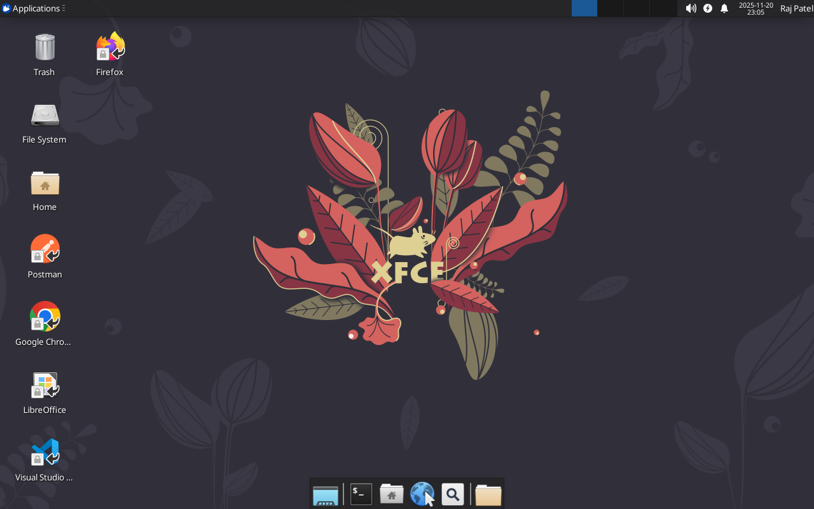
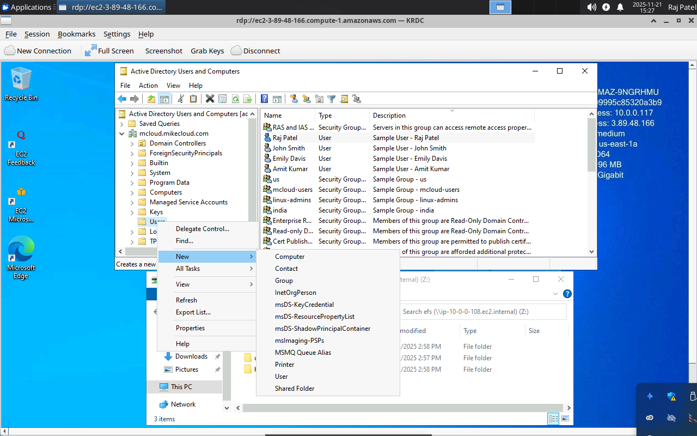
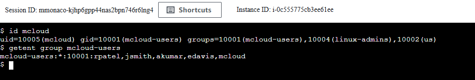

# OCI Xubuntu XRDP Cloud Development Environment

This project provisions a **complete cloud-based Linux desktop development environment**
on Oracle Cloud Infrastructure using **Xubuntu + XRDP**, **Mini Active Directory**, and
**OCI File Storage Service (FSS)**.

It is designed as a **universal dev workstation** containing the full superset of tools,
dependencies, and configurations used across all build projects on the channel.



Instead of manually configuring a workstation for each tutorial, demo, or cloud project,
this solution automatically provisions:

1. **A Custom Xubuntu XRDP Image (Packer)**
   - Preloaded with Chrome, Firefox, VS Code, Docker, KRDC, Postman, OnlyOffice
   - Full development tooling: **Packer, Terraform, Docker CLI, AWS CLI v2, Azure CLI, Google Cloud CLI, OCI CLI**
   - Snap-free, clean, lightweight Xfce desktop
   - XRDP fully configured with all required fixes and defaults
   - Desktop/panel icons, terminal emulator defaults, `/etc/skel` customizations

2. **A Mini Active Directory Domain (Terraform)**
   - Samba 4 AD Domain Controller on OCI A1.Flex (ARM64)
   - Domain users created from a template with memorable passwords
   - Central authentication for Linux and Windows clients

3. **Domain-Joined Xubuntu Desktop (Terraform)**
   - E4.Flex instance (4 OCPU / 16 GB) deployed from the Packer-built image
   - Automatically joins AD during boot via `realm join`
   - Home directories served from FSS via NFS

4. **OCI File Storage Service for Persistent Home Directories**
   - FSS mount target in the VM subnet
   - `/home` export mounted on the Xubuntu instance — AD user home dirs persist across rebuilds
   - `/nfs` export re-shared via Samba so the Windows client maps `Z:`

5. **Domain-Joined Windows Client (Terraform)**
   - Windows Server 2022 E4.Flex (2 OCPU / 8 GB)
   - Joins AD and maps `Z:` to `\\<xubuntu-private-ip>\nfs` at every login
   - RSAT pre-installed for AD administration

---

## Prerequisites

- An [OCI account](https://cloud.oracle.com) with `~/.oci/config` configured (DEFAULT profile)
- [OCI CLI](https://docs.oracle.com/en-us/iaas/Content/API/SDKDocs/cliinstall.htm) installed and authenticated
- [Terraform](https://developer.hashicorp.com/terraform/install) ≥ 1.5
- [Packer](https://developer.hashicorp.com/packer/install) ≥ 1.9
- `jq` installed

Set your compartment OCID (or leave unset to default to the root tenancy):

```bash
export OCI_COMPARTMENT_ID=ocid1.compartment.oc1...<your-compartment>
```

---

## Download this Repository

```bash
git clone https://github.com/mamonaco1973/oci-xubuntu-xrdp.git
cd oci-xubuntu-xrdp
```

---

## Build the Code

Run `check_env.sh` to validate your environment, then `apply.sh` to provision everything:

```bash
./apply.sh
```

The deploy runs in three phases:

| Phase | Directory | What it does |
|-------|-----------|--------------|
| 1 | `01-directory` | VCN, subnets, Bastion, AD DC, SSH keys, user passwords |
| 2 | `02-packer` | Builds the custom Xubuntu OCI image (~25–35 min) |
| 3 | `03-servers` | FSS, Xubuntu desktop instance, Windows client |

---

## Build Results

When the deployment completes, the following resources exist:

**Networking**
- VCN with public (`vm-subnet 10.0.0.64/26`) and private (`ad-subnet 10.0.0.0/26`) subnets
- Internet Gateway (public subnet) and NAT Gateway (private subnet)
- Security lists with rules for SSH, RDP, NFS, SMB, and AD traffic

**Active Directory**
- Samba 4 DC on A1.Flex (ARM64) in the private subnet
- OCI Bastion (STANDARD) for SSH tunnel access to the DC
- Domain users with memorable passwords (`word-NNNNNN` format)

**Packer Image**
- Custom OCI image `xubuntu-image` containing:
  - Xubuntu (Xfce4), XRDP, Chrome, Firefox, VS Code
  - Terraform, Packer, Docker, AWS CLI v2, Azure CLI, Google Cloud CLI, OCI CLI
  - KRDC, Postman, OnlyOffice
  - `/etc/skel` configured with desktop shortcuts and terminal defaults

**Compute**
- Xubuntu desktop: E4.Flex 4c/16GB, public IP, domain-joined
- Windows client: E4.Flex 2c/8GB, public IP, domain-joined

**File Storage**
- FSS file system with mount target in vm-subnet
- `/nfs` export mounted on Xubuntu; `/home` export for AD user home dirs
- Samba `[nfs]` share for Windows Z: drive mapping

---

## Users and Groups

Sample users and groups are created automatically on the AD DC at deploy time.

### Groups

| Group Name         | gidNumber |
|--------------------|-----------|
| mcloud-users       | 10001     |
| india              | 10002     |
| us                 | 10003     |
| linux-admins       | 10004     |

### Users

| Username | Full Name   | uidNumber | Groups                            |
|----------|-------------|-----------|-----------------------------------|
| jsmith   | John Smith  | 10001     | mcloud-users, us, linux-admins    |
| edavis   | Emily Davis | 10002     | mcloud-users, us                  |
| rpatel   | Raj Patel   | 10003     | mcloud-users, india, linux-admins |
| akumar   | Amit Kumar  | 10004     | mcloud-users, india               |

Retrieve any password with:

```bash
./get_password.sh rpatel
./get_password.sh admin
./get_password.sh windows_local_admin
```

---

## Connecting

After `apply.sh` completes, run `validate.sh` to print connection details:

```bash
./validate.sh
```

**RDP to Xubuntu desktop:**

```
Host : <xubuntu_public_ip>:3389
User : rpatel  (or any AD user)
Pass : ./get_password.sh rpatel
```

**SSH to Xubuntu:**

```bash
ssh -i 01-directory/keys/Private_Key ubuntu@<xubuntu_public_ip>
```

**SSH to Domain Controller (via Bastion):**

```bash
./connect.sh
```

**RDP to Windows client:**

```
Host : <windows_public_ip>:3389
User : MCLOUD\Admin  (or windows_local_admin as fallback)
Pass : ./get_password.sh admin
```



---

## Creating a New Desktop User

1. RDP to the Windows client and open **Active Directory Users and Computers**
2. Enable **View → Advanced Features**
3. Navigate to the **Users** OU and create a new user
4. Open PowerShell and run `Z:\oci-xubuntu-xrdp\04-utils\getNextUID.bat` to get the next available UID
5. In the user's **Attribute Editor**, set `uid`, `uidNumber`, and `gidNumber` (10001 for mcloud-users)
6. Add the user to **mcloud-users** and any other groups

Validate on the Xubuntu instance:

```bash
id <username>
```



---

## Clean Up

```bash
./destroy.sh
```

Destroys in reverse order: `03-servers`, then the Packer image from OCI, then `01-directory`.
The SSH key files in `01-directory/keys/` are also removed.
